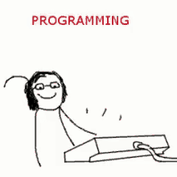

# 💥 Coding Snippets Library in C++

## 🔗 [Snippet Library ](https://aadilmughal786.github.io/portfolio/code/ "Snippet Library")

[](https://aadilmughal786.github.io/portfolio/code/ "The Real Programmer")

### These vs-code extension can be very handy in your problem solving journey

### 🠒 [Local Snippet](https://marketplace.visualstudio.com/items?itemName=devonray.snippet "Local Snippet")

### 🠒 [Cp Helper](https://marketplace.visualstudio.com/items?itemName=km.competitive-coding-helper "Cp Helper")

</br>

<pre>
████████▄     ▄████████    ▄████████ 
███   ▀███   ███    ███   ███    ███ 
███    ███   ███    █▀    ███    ███ 
███    ███   ███          ███    ███ 
███    ███ ▀███████████ ▀███████████ 
███    ███          ███   ███    ███ 
███   ▄███    ▄█    ███   ███    ███ 
████████▀   ▄████████▀    ███    █▀  
</pre>

#### 1. [Array](https://aadilmughal786.github.io/portfolio/code/array/ "Array")

#### 2. [List](https://aadilmughal786.github.io/portfolio/code/list/ "List")

#### 3. [Stack](https://aadilmughal786.github.io/portfolio/code/stack/ "Stack")

#### 4. [Queue](https://aadilmughal786.github.io/portfolio/code/queue/ "Queue")

#### 5. [Map](https://aadilmughal786.github.io/portfolio/code/map/ "Map")

#### 6. [Tree](https://aadilmughal786.github.io/portfolio/code/tree/ "Tree")

#### 7. [Graph](https://aadilmughal786.github.io/portfolio/code/graph/ "Graph")

#### 8. [DSU](https://aadilmughal786.github.io/portfolio/code/dsu/ "DSU")

#### 9. [Number Theory](https://aadilmughal786.github.io/portfolio/code/number-theory/ "Number Theory")

<Br/>

#### 🤖 Starter Code

```
// #include<bits/stdc++.h>
#include <iostream>
#include <queue>
#include <stack>
#include <vector>
// #include <cstring>
// #include <array>

#define ll long long
#define ull unsigned long long
#define pb push_back
#define mp make_pair
#define fi first
#define se second
#define fast_io                                                                \
  ios_base::sync_with_stdio(false);                                            \
  cin.tie(NULL);                                                               \
  cout.tie(NULL);

using namespace std;
void solve();

// write your code declaration/defination

//---------------------------------------

int main() {
  fast_io int t = 1;
  // cin>>t;
  while (t--) {
    solve();
  }

  return 0;
}

void solve() {}
```
